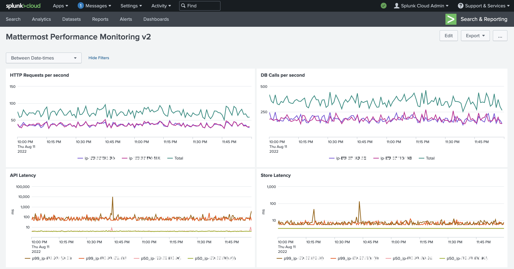
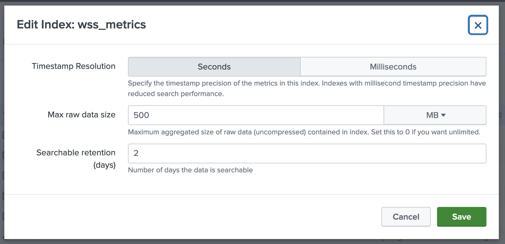
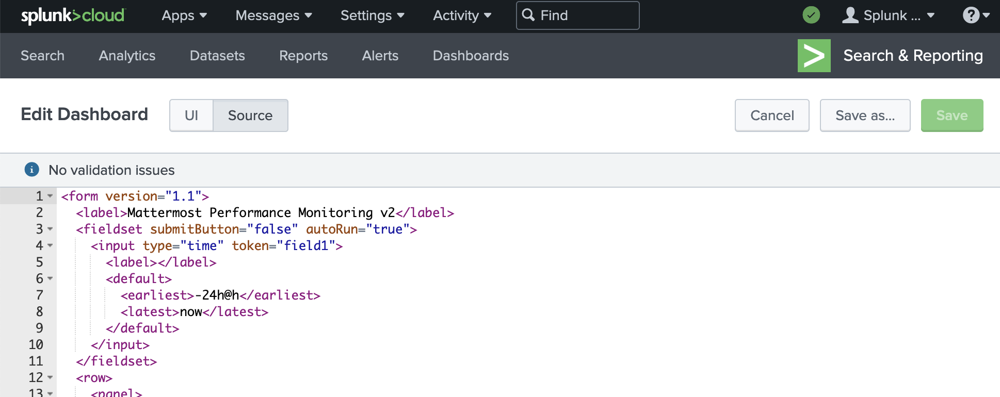

# mattermost-splunk-metrics

Mattermost provides a robust [performance monitoring](https://docs.mattermost.com/scale/performance-monitoring.html) solution backed by [Prometheus](https://prometheus.io/) & [Grafana](https://grafana.com/), but occasionally it is necessary to integrate with an alternate platform. This repository contains setup instructions, scraping tools, and dashboards to integrate with [Splunk](https://www.splunk.com/):



## Setup

### Mattermost
Performance monitoring with Mattermost requires an [Enterprise](https://mattermost.com/pricing/) license. Enable metrics in the config:
```json
    "MetricsSettings": {
        "Enable": true,
        "BlockProfileRate": 0,
        "ListenAddress": ":8067"
    },
```

and verify metrics after restarting the Mattermost server:
```sh
> curl -s localhost:8067/metrics | head
# HELP go_gc_duration_seconds A summary of the pause duration of garbage collection cycles.
# TYPE go_gc_duration_seconds summary
go_gc_duration_seconds{quantile="0"} 3.3792e-05
go_gc_duration_seconds{quantile="0.25"} 0.000103459
go_gc_duration_seconds{quantile="0.5"} 0.0001845
go_gc_duration_seconds{quantile="0.75"} 0.000223374
go_gc_duration_seconds{quantile="1"} 0.011890667
go_gc_duration_seconds_sum 0.070865825
go_gc_duration_seconds_count 235
# HELP go_goroutines Number of goroutines that currently exist.
```

### Splunk

Create a metrics index named `wss_metrics`, and choose a maximum size and retention period appropriate to your installation.



Create a classic dashboard and edit the source to match [dashboards/mattermost-performance-monitoring-v2\_rev1.xml](dashboards/mattermost-performance-monitoring-v2_rev1.xml):



If you choose to use another name, be sure to update the dashboard configuration and scraping tool settings appropriately.

### prometheus2splunk

Compile `prometheus2splunk` for the operating system and architecture matching your Mattermost installation:
```sh
cd prometheus2splunk
GOOS=linux GOARCH=amd64 go build -o prometheus2splunk .
```

Copy `prometheus2splunk` to each application server and setup to run as a background job using your scheduling service of choice. A number of configuration options are available:
``` sh
> ./prometheus2splunk --help
Usage of ./prometheus2splunk:
  -allow_insecure
        skip certificate verification
  -log_level string
        logrus log level (error, info, debug, ...) (default "info")
  -scrape_interval duration
        interval on which to scrape (default 15s)
  -scrape_target string
        prometheus exporter to scrape (default "http://localhost:8067/metrics")
  -splunk_authorization string
        token to authorize splunk
  -splunk_target string
        splunk hostname
  -timeout duration
        http request timeouts (default 3s)
```

In addition to passing as flags, the configuration can be specified as environment variables:
```
export SCRAPE_INTERVAL=15s
export ALLOW_INSECURE=true
export SPLUNK_TARGET=https://<your id>.splunkcloud.com:8088/services/collector
export SPLUNK_AUTHORIZATION=<your token>
export LOG_LEVEL=debug

./prometheus2splunk 
```

Running with at least debug logs enabled shows the regular background operation, but otherwise the job is silent:
```
./prometheus2splunk --scrape_interval 15s --allow_insecure --splunk_target https://<your id>.splunkcloud.com:8088/services/collector --splunk_authorization <your token> --log_level debug
DEBU[0000] loaded config                                 config="map[allow_insecure:true log_level:debug scrape_interval:15s scrape_target:http://localhost:8067/metrics splunk_authorization:<your token> splunk_target:https://<your id>.splunkcloud.com:8088/services/collector timeout:3s]"
DEBU[0000] scraping target                               scrape_target="http://localhost:8067/metrics"
DEBU[0000] read body                                     bytes=625660 scrape_target="http://localhost:8067/metrics"
DEBU[0000] successfully posted payload                   bytes=0 splunk_target="https://<your id>.splunkcloud.com:8088/services/collector"
DEBU[0000] sleeping until next scrape                    duration=15s
DEBU[0015] scraping target                               scrape_target="http://localhost:8067/metrics"
DEBU[0015] read body                                     bytes=625637 scrape_target="http://localhost:8067/metrics"
DEBU[0015] successfully posted payload                   bytes=0 splunk_target="https://<your id>.splunkcloud.com:8088/services/collector"
DEBU[0015] sleeping until next scrape                    duration=15s
```

## Limitations

This repository and Splunk is not a complete replacement for Prometheus & Grafana:
* At the present time, only [Mattermost Performance Monitoring v2](https://grafana.com/grafana/dashboards/15582-mattermost-performance-monitoring-v2/) is available.
    - Only the `Application Metrics` row is implemented; `Cluster Metrics`, `Job Server`, and `System Metrics` have not yet been implemented.
    - Additionally, on the `Application Metrics` row, the `Top 10 DB calls by duration` and `Top 10 API requests by duration` graphs have not yet been implemented.
* Prometheus' default behaviour for histograms renders a detailed graph, whereas this repository and Splunk shows fewer data points for the same range.
* Splunk does not support a non-base-10 logarithmic scale, making some graphs harder to read.
* Splunk does not support the annotations that enable Prometheus & Grafana to highlight server restart events and background jobs.
* Splunk does not support the Shared crosshair Graph Tooltip that simplify correlating events across multiple charts.
